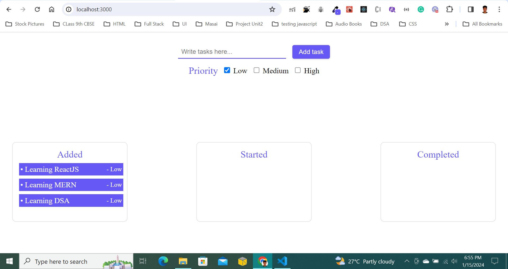
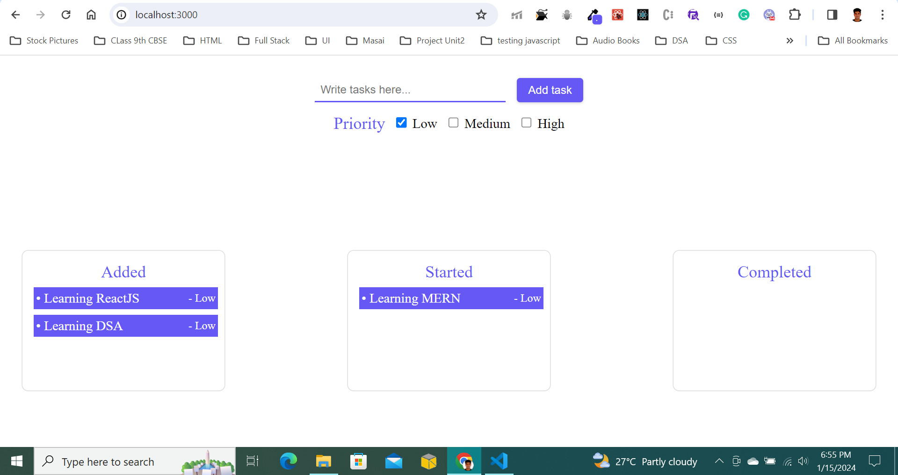

# Task-drag-drop App

## Command
### npm run start (to start the server)
### npm run build (to build the server at production)

## Optimization
### 1. Using Webpack (for HMR, bundles & chunks)
### 2. Reusable components

#### Adding tasks to Added list

#### Dragging tasks to other lists

#### Thank you
